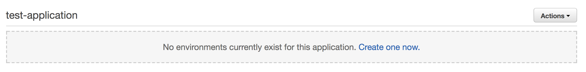

# AWS-CLI Elasticbeanstalk


## Installation


```bash
# Install/upgrade
$ pip install awscli --upgrade --user

# Verify installation
$ aws --version

# Uninstall 
$ pip uninstall awscli
$
```

The `--upgrade` option tells pip to upgrade any requirements that are already installed. The `--user` option tells pip to install the program to a subdirectory of your user directory to avoid modifying libraries used by your operating system.


## Commands

For the full list of available commands, you can refer the official documentation [here](http://docs.aws.amazon.com/cli/latest/reference/elasticbeanstalk/index.html).

## Setup Application

To create an application, we need to configure certain parameters. There are two options to create the application:

1. Specifying all the parameters in the json file
2. Specifying it in the cli when running `aws-cli`

Let's take a look at the first option. To print out the sample template of parameters that needs to be configured:

```bash
$ aws elasticbeanstalk create-application --generate-cli-skeleton
```

Output:
```bash
{
    "ApplicationName": "",
    "Description": "",
    "ResourceLifecycleConfig": {
        "ServiceRole": "",
        "VersionLifecycleConfig": {
            "MaxCountRule": {
                "Enabled": true,
                "MaxCount": 0,
                "DeleteSourceFromS3": true
            },
            "MaxAgeRule": {
                "Enabled": true,
                "MaxAgeInDays": 0,
                "DeleteSourceFromS3": true
            }
        }
    }
}
```
Save the output as `config.json`, fill in the `name` and `desciption`, and run the following command:

```bash
$ aws elasticbeanstalk create-application --cli-input-json config.json
```

For the second option, you can just run the following:

```bash
$ aws elasticbeanstalk create-application --application-name "test-application" \
--description "This is a test application"
```

Output:



## Update application

The only fields that can be updated is the application description:

```bash
$ aws elasticbeanstalk update-application --application-name test-application --description "this is an edited description"
```


## Delete application

    Note: You cannot delete an application that has a running environment.


To delete the previous application that we created: 

```bash
$ aws elasticbeanstalk delete-application --application-name test-application
```

In order to force delete an application that contains running environments:

```bash
$ aws elasticbeanstalk delete-application --application-name test-application --terminate-env-by-force true
```

## Setup environment

If you have a running environment and wish to see the configuration:

```bash
$ aws elasticbeanstalk describe-configuration-settings  --application test-application --environment-name test-application-development
```